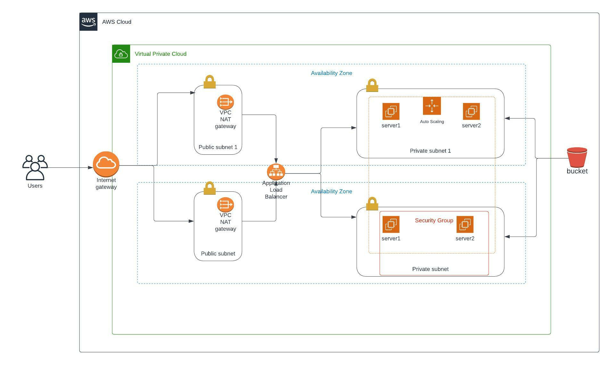

### Project Title - Deploy a high-availability web app using CloudFormation
This folder provides the code for the "ND9991 - C2- Infrastructure as Code - Deploy a high-availability web app using CloudFormation" project. This folder contains the following files:


#### network-parameters.json
This file contains the parameters for the network parameters to increase the generic nature of the network.yml code.

#### server-parameters.json
This file contains the parameters for the network parameters to increase the generic nature of the server.yml code.

#### network.yml
This file contains the code for the network cloud formation script.

#### servers.yml
This file contains the code for the network cloud formation script. It contains configuration for the load balancers and the web group.

### udagram-infra.jpg
  an image showing the infrastructure diagram followed.

## How to run this cloud formation script:
``` ./create.sh udagramserver servers.yml server-parameters.json ```

#### To update:

```./update.sh udagramserver servers.yml server-parameters.json ```


### live link
[udagram](http://udagr-webap-1i521wm32u4ci-661153407.us-east-1.elb.amazonaws.com/)

